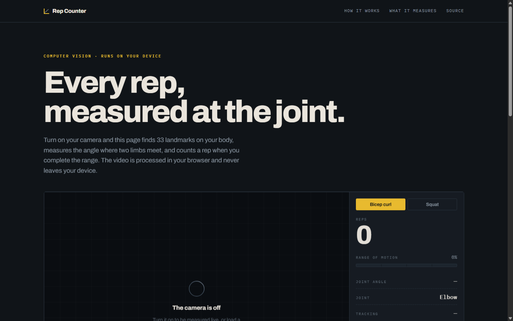

# Pose monitor

A rep counter that reads your body. A camera frame goes to a pose model, the model returns 33
body landmarks, the angle at one joint is measured, and a rep is counted when that angle sweeps
its full range and comes back. Two exercises: bicep curl at the elbow, squat at the knee.

Two versions share the same rule:

- **Browser demo**, live at **[pose.yakubhossain.dev](https://pose.yakubhossain.dev)**. The
  pose model runs as WebAssembly on your device. The video never leaves your computer and the
  server only hands out static files.
- **Python app** (`AITrainer.py`) for a desktop with a webcam, with a headless mode for
  files and tests.



## How the count works

Three landmarks make a joint: shoulder, elbow, wrist for the curl; hip, knee, ankle for the
squat. The angle at the middle point is the measurement. It is mapped to a range of motion
from 0 to 100 percent (curl: 160 degrees is 0, 50 degrees is 100; squat: 165 to 70). A rep
has two halves: reaching the top (99 percent or more), then returning (1 percent or less).
Both sides of the body are tried on every frame and the side the camera sees best wins.
Landmarks below 0.5 visibility are ignored, so a hidden joint never counts.

The same constants live in `AITrainer.py` and `web/trainer.js`. The Python tests cover the
counting rule, the angle maths, a headless video run and the layout on a small frame.

## Browser demo

```
web/
  index.html      the page
  styles.css      design: a measuring instrument, not a gym poster
  trainer.js      camera, pose model, angle, rep count, canvas overlay
  fetch-assets.sh downloads the MediaPipe runtime and the model (about 28 MB, not in git)
  fonts/          Archivo and IBM Plex Mono, self hosted
```

Run it locally with any static server (the WebAssembly runtime needs http, not a file path):

```bash
cd web && bash fetch-assets.sh && python -m http.server 8000
```

Open http://localhost:8000, allow the camera, pick an exercise. Without a camera, load a
video file. If the local runtime files are missing, the page falls back to the jsDelivr CDN
and Google's model host.

## Python app

```bash
pip install -r requirements.txt
python main.py --exercise curl            # webcam
python main.py --exercise squat --source clip.mp4 --out counted.mp4 --headless
python -m pytest -q tests
```

Needs Python 3.12 and a current `mediapipe` (the Tasks API). The model downloads on first
run.

## Deploy

Every push to `main` runs the Python tests, builds the nginx image for arm64 and amd64
(fetching the runtime and model during the build), pushes it to
`ghcr.io/1yakub/pose-monitor`, and asks Coolify to pull and restart. The image serves
`web/` with long cache headers on the runtime, model and fonts, and the right types for
WebAssembly and ES modules.

## History

The 2023 version ran on the MediaPipe Solutions API, which Google removed; it could not
start on any current release. In August 2026 it was rewritten on MediaPipe Tasks with tests,
and in September 2026 the browser demo was finished and deployed.

## License

MIT. See [LICENSE](LICENSE).
